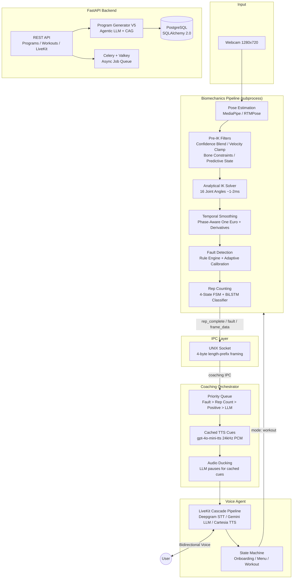

# Nowva AI

**Real-time AI fitness coach — voice interaction, computer vision, and biomechanics analysis at 30 FPS**


---

## Table of Contents

- [Project Status](#project-status)
- [Overview](#overview)
- [System Architecture](#system-architecture)
- [Console Voice Agent (main.py)](#console-voice-agent-mainpy)
- [Biomechanics Pipeline](#biomechanics-pipeline)
  - [Pose Estimation](#1-pose-estimation)
  - [Multi-Camera Triangulation](#2-multi-camera-triangulation)
  - [Pre-IK Skeleton Filtering](#3-pre-ik-skeleton-filtering)
  - [Analytical Inverse Kinematics](#4-analytical-inverse-kinematics)
  - [Temporal Smoothing](#5-temporal-smoothing)
  - [Fault Detection](#6-fault-detection)
  - [Rep Counting](#7-rep-counting-dual-system)
  - [Barbell Tracking](#8-barbell-tracking)
  - [Exercise Profiles](#9-exercise-profiles)
- [Coaching System](#coaching-system)
- [Program Generator V5](#program-generator-v5)
- [Squat Visualizer (visualize_video_squats.py)](#squat-visualizer)
- [Database Schema](#database-schema)
- [Tech Stack](#tech-stack)
- [Project Structure](#project-structure)
- [Getting Started](#getting-started)
- [Testing](#testing)
- [Profiling & Benchmarking](#profiling--benchmarking)

---

## Project Status

**Current Focus:** Squat diagnosis accuracy on the 3-camera rig (rebuilt pre-IK signal path, lifter-based camera calibration) and on-device speech affect perception so Nova adapts to how the athlete sounds.

### Recent Changes (September 2026)

#### Speech Affect Perception V1 (Session 2026-09-17)
- **Edge-only perception path:** `src/affect/` runs an ONNX speech-emotion model (arousal / valence / dominance + prosody) on every utterance via onnxruntime, with per-speaker neutral baselines and hysteresis. No cloud call enters the path; the deployed graph lives in `models/affect/current/` and targets Jetson Orin Nano Super.
- **Two-field LLM interface:** the agent sees at most `[athlete: effort=… affect=…]`, sized for a 2B local model. `AffectNodesMixin` injects it in `llm_node` with a ≤40 ms wait budget (zero added latency on coaching replies) and applies TTS style in `tts_node`; the LLM never writes voice tags.
- **Coaching gates:** humor off when the athlete sounds frustrated or strained, calmer motivation near limit, athlete-state line in the post-set recap. Rep ascent time feeds the effort state. `FAULT_CUE` priority and the cached cue path are untouched.
- **Training + tooling:** `training/affect/` (train / eval / export / report CLI, TensorRT build script), `benchmarks` affect component, replay and TTS-probe tools, profiler `affect` category, ContextViewer and display pill. V1a model is the audEERING wav2vec2 export; MSP-Podcast training is pending the data agreement. Start at `docs/affect/HANDOFF.md`.

#### Pre-IK Signal Path Rebuild + Camera Calibration (Sessions 2026-09-16/18)
- **Pre-IK rebuild:** a nine-agent audit against a ground-truth 3-camera squat simulator showed every legacy pre-IK filter except the velocity clamp made accuracy worse. Replaced with a fixed-lag Kalman smoother per keypoint (lagged analysis stream + undelayed display stream), world-frame foot contact (heel rise, stance width, toe-out → new `HeelRiseRule`) and session-scoped segment-length measurement. Reports in `.claude/preik-audit/`.
- **Camera calibration:** intrinsics + factory extrinsics from a ChArUco board (`scripts/tools/calibrate_cameras.py`); field extrinsics from the lifter via sparse bundle adjustment with the barbell as metric scale — within 0.3 mm of perfect calibration on the simulator. Drift refines are validated on held-out frames and rejected if they move metric scale by more than 1 %.

#### Website
- Landing page tightened: removed the One Set section, moved the "Fully Local Intelligence" card from the Manifesto up into the RackShowcase, rewrote the Coach and Flywheel copy.

**Verification:** 1478 tests passing. Known pre-existing failures outside this work: program-generator suites (`test_v6_verification.py`, `test_phase3_v5.py`, `test_phase4_v5.py`, `test_program_generator_suite.py`) and `test_audio_cue_service.py` (imports a removed constant).

### Recent Changes (August 2026)

#### Biomechanics Speed & Benchmarking (Session 2026-08-18/19)
- **GPU-Batched Multi-Camera Pose Estimation:** RTMPoseEstimator now batches all camera views in one ONNX inference pass. Constant-shape padding via `_run_padded()` ensures CoreML MLProgram format compiles stably (fails on dynamic batch sizes). All 3 cameras processed in ~3ms vs ~9ms serially; full pipeline throughput ~14ms/frame (~71 FPS capacity on dev Mac).
- **CoreML MLProgram Provider Option:** Replaced legacy NeuralNetwork format with MLProgram in initialization — ~30% faster (batch-3 inference: 15.2ms → 10.4ms) with exact keypoint-argmax parity to CPU. Production path now uses this acceleration transparently.
- **Preprocess Rewrite:** Refactored to resize first, fold BGR→RGB into CHW transpose while uint8, fused in-place per-channel normalization (3D array broadcast over CHW planes is 7x faster than HWC). Output stable to 5e-7 vs old implementation. Time: 3.0ms → 0.7ms for 3 frames.
- **Vectorized DLT Triangulator:** Keypoints grouped by camera-visibility sets, one `cv2.triangulatePoints()` per 2-view group, one stacked numpy SVD per 3+ views. Vectorized reprojection error. Time: 0.64ms → 0.18ms; 3D points and confidence bit-identical to old code within 5e-15.
- **Benchmark Suite Fixes:** `bench_pose` used synthetic person-free image (MediaPipe fast-path, ~12ms vs real ~65ms) and default model_complexity=1 instead of production 2 — now uses real squat video frames normalized to 1280x720 + production config. `bench_pipeline` called `process_frame()` with no args (TypeError swallowed) — now uses `load_pipeline_config()`, `defer_capture=True`, frame injection via capture lock. `bench_bilstm` lacked required model_path — now uses config's model path/device. All now measure real end-to-end performance.
- **New Tests:** `tests/test_biomechanics/test_rtmpose.py` — 9 tests for `estimate_batch()` with fake ONNX session, batch padding, alignment, low-confidence None, error cases. All 589 tests passing.

**Validated Results:** Old single-camera MediaPipe path: 69.9ms/frame (14.7 FPS, fails 33.3ms threshold). New multi-camera GPU-batched path: ~14ms/frame (~71 FPS, large headroom for 30 FPS cameras). **5x speedup** while adding true 3-camera triangulation.

#### Prior Changes (Earlier August 2026)
- **Wake Word Detection System:** Added ONNX-based local wake word detection (`livekit-wakeword`, `pvporcupine`) to voice agent for hands-free activation without cloud STT. 16kHz audio processing with 80ms stride, multi-frame confirmation scoring to reject false positives.
- **Display Server & Boot Progress UI:** New persistent display server (browser at http://localhost:5000) that opens on startup, shows boot progress milestones (neural cores → voice activity sensors → coaching audio → wake word sentinel → speech engine → conversational reasoning), and publishes live coaching state + biomechanics frames during workouts.
- **Progress Context Formatting:** Pure text formatters (`progress_context.py`) turn persisted session data into natural language (e.g., "last session 2 days ago, 45 reps, form score 82/100") for the coaching LLM to cite verbatim in greetings and post-set recaps. Trend analysis over 3-4 recent sets.
- **Agent Persona Overhaul:** Refactored all agent prompts (onboarding, main menu, workout, schedule, program creation, coaching) from prescriptive, scripted instructions to natural, conversational guidance. Nova identity and spoken-output rules now centralized (`base_prompt.py`). Added TTS normalizer (`tts_normalizer.py`) to strip markdown, emoji, and symbols from agent speech before audio synthesis. All agents now encouraged to vary responses, avoid repetition, and sound like a real person — not a script.

### YC Application Readiness
- Core demo loop: webcam → real-time 3D skeleton → fault detection → voice cue (all on-device, <50ms latency).
- Marketing site live on Vercel with 3D rack model, technical proof, pricing tier, and preorder capture; now hardened with full legal pages, privacy-first analytics, mobile UX, and rate limit protection.
- Edge-first architecture validated: no cloud dependency for conversational layer, inference runs on Jetson Nano.

### Known Limitations / TODO
- Barbell tracking (z-depth) remains noisy on single-camera setups; multi-camera triangulation in place but not yet field-tested at scale.
- Rep counter BiLSTM classifier trained on 8 users; generalization on new anthropometry TBD.
- Program generator V5 working but not yet integrated into the live voice agent for automated workout difficulty scaling.
- Website Vercel domain import and DNS verification pending (domain: nowva.ai via Cloudflare Tunnel); Resend domain verification needed for email deliverability.

---

## Overview

Nowva AI is a real-time fitness coaching platform that watches you exercise through a webcam, reconstructs your 3D skeleton, computes joint kinematics, detects form faults, and coaches you with voice — all in real time. The system combines a conversational voice agent (LiveKit Agents SDK), a custom biomechanics pipeline processing 30 FPS video, and an agentic LLM pipeline for personalized workout programming.

The platform operates across two surfaces:

1. **Website** — A standalone Next.js marketing site in `website/`, deployed on Vercel. Presents the product and the technology, and captures founding-batch preorder reservations (name + email via Resend). Fully decoupled from this backend.

2. **Console application** — The full coaching system (`main.py`) that runs on a squat rack computer or laptop. Captures webcam video, runs real-time biomechanics analysis, delivers voice coaching with fault cues, manages workout sessions, and tracks long-term training progress.

**Key numbers:**
- Analytical IK solver: **~1-2ms per frame** on CPU (16 joint angles from 3D skeleton)
- Program generation: **~1 second** via Cache Augmented Generation (down from 10 minutes)
- Fault cue latency: **< 50ms** (pre-cached TTS)
- Supported exercises: **12 exercise profiles** with independent fault rules
- Pre-IK filtering: **4-stage pipeline** (confidence blend, velocity clamp, bone constraints, predictive state)

---

## System Architecture



### Multi-Process Architecture

The console application (`main.py`) orchestrates multiple processes:

```
NowvaApp (main.py)
├── FastAPI backend server        (subprocess, uvicorn, port 8000)
├── Voice agent                   (subprocess, LiveKit Agents SDK)
├── Pose estimation               (subprocess, reads from camera)
├── Main IPC server               (/tmp/nowva_ipc.sock)
└── Coaching IPC server           (/tmp/nowva_coaching.sock)
```

Each process communicates via **UNIX domain sockets** with 4-byte big-endian length-prefix framing and JSON payloads. Two IPC channels:
- **Main IPC** — pose pipeline sends frame data (skeleton, angles, faults, rep events) to the main process
- **Coaching IPC** — main process forwards events to the voice agent for real-time coaching delivery

Mode transitions are signaled over a **notification pipe** rather than file polling: the voice agent writes to a pipe fd when it changes `AgentState`, and `main.py` `select()`s on it alongside subprocess stdout. The biomechanics pipeline supports **model preloading** (`--preload`) — models load before the workout starts so the camera window appears instantly (with a native macOS fullscreen animation).

---

## Console Voice Agent (main.py)

**Entry point:** `src/main.py` (NowvaApp orchestrator)
**Agent code:** `src/agent/agents/voice_agent.py` (mode router)
**Individual agents:** `src/agent/agents/onboarding_agent.py`, `src/agent/agents/main_menu_agent.py`, `src/agent/agents/workout_agent.py`, `src/agent/agents/program_creation_agent.py`, `src/agent/agents/schedule_agent.py`, `src/agent/agents/calibration_agent.py`

The full coaching application for authenticated users running on a squat rack computer or laptop.

### Voice Pipeline

| Component | Technology | Purpose |
|-----------|-----------|---------|
| STT | Deepgram Nova-3 | Speech-to-text |
| LLM | Google Gemini 3.1 Flash Lite | Fast, low-cost conversation |
| TTS | Cartesia Sonic-3 | Text-to-speech |
| VAD | Silero (prewarmed) | Voice activity detection |
| Turn Detection | MultilingualModel | End-of-utterance detection |

The voice pipeline is **prewarmed** — VAD and AudioCueService are loaded in parallel before room connection, reducing session startup latency from ~2s to <500ms.

### Mode-Aware State Machine

The agent operates as a persistent state machine with mode-specific system prompts and function tools:

```
OnboardingAgent ──→ MainMenuAgent ──→ WorkoutAgent
                         │                  │
                         ├──→ ProgramCreationAgent
                         │
                         └──→ ScheduleMaintenanceAgent
```

| Mode | Agent | Purpose | Key Function Tools |
|------|-------|---------|--------------------|
| Onboarding | `OnboardingAgent` | New user welcome, name/email collection (AgentTask-based flow) | `complete_onboarding()` |
| Main Menu | `MainMenuAgent` | Menu navigation, intent detection | `start_workout()`, `start_quick_exercise()`, `get_current_program()` |
| Quick Exercise | `CollectExerciseInfoTask` | Collects sets/reps/weight/rest, routes to calibration or workout | `start_workout()` |
| Calibration | `CalibrationAgent` | 2-rep form assessment + 5-rep calibration before a workout | — |
| Workout | `WorkoutAgent` | Live workout coaching with biomechanics | `log_workout_complete()`, `skip_exercise()`, `pause_workout()` |
| Program Creation | `ProgramCreationAgent` | Conversational program generation | `generate_new_program()`, `capture_profile()` |
| Schedule | `ScheduleMaintenanceAgent` | Workout scheduling, deload management | `view_schedule()`, `reschedule_workout()` |

### Persistent State

Session state is serialized to disk as `.agent_state_<user_id>.json` and survives app restarts. The `AgentState` class tracks:
- Current mode
- User profile data
- Active workout session
- Conversation context
- Program references

### Context Compaction

The `CompactionService` (`src/agent/services/compaction_service.py`) performs rolling conversation summarization using `gpt-4.1-mini`, maintaining a 3-tier (HOT/WARM/COLD) summary that decays over time. Cold context is flushed to a per-session `memory.md` on disk, and a detailed compaction log records every cycle. This prevents token explosion in long workout sessions while preserving coaching context. A `ContextViewer` debug dashboard is available at `http://localhost:8899`.

### Workout Mode Integration

During workouts, the voice agent coordinates with the biomechanics pipeline through the coaching orchestrator:
1. Biomechanics pipeline detects faults and rep events
2. Events flow over IPC to the coaching orchestrator
3. Orchestrator dispatches cached audio cues (priority 1-3) or LLM speech (priority 10-20)
4. Audio ducking pauses LLM speech when cached cues play
5. Context swapping isolates coaching LLM calls from the main conversation context

---

## Biomechanics Pipeline

**Location:** `src/biomechanics/`
**Orchestrator:** `src/biomechanics/pipeline.py`
**Config:** `src/biomechanics/config.py` + `config/biomechanics.yaml`

Six processing layers orchestrated by a single `process_frame()` call that returns a `PipelineFrame` containing the 2D/3D skeleton, joint angles, detected faults, rep data, BiLSTM predictions, and per-layer latency measurements.

```
Camera Frame (1280x720 BGR)
  │
  ▼
┌──────────────────────────────────────┐
│  1. Pose Estimation                  │  MediaPipe or RTMPose (ONNX)
│     17 COCO keypoints + 3D coords   │  → Skeleton2D + Skeleton3D
└──────────────┬───────────────────────┘
               ▼
┌──────────────────────────────────────┐
│  2. Pre-IK Filtering (4 stages)     │  Confidence Blend → Velocity Clamp
│     Clean noisy pose estimates       │  → Bone Constraints → Predictive State
└──────────────┬───────────────────────┘
               ▼
┌──────────────────────────────────────┐
│  3. Analytical IK Solver             │  Vector geometry → 16 joint angles
│     ~1-2ms per frame on CPU          │  → JointAngles dataclass
└──────────────┬───────────────────────┘
               ▼
┌──────────────────────────────────────┐
│  4. Temporal Smoothing               │  Phase-aware One Euro filter
│     + Derivative Tracking            │  Angular velocity & acceleration
└──────────────┬───────────────────────┘
               ▼
┌──────────────────────────────────────┐
│  5. Fault Detection                  │  5-rule engine with two-phase
│     Body-proportion-scaled thresholds│  adaptive calibration
└──────────────┬───────────────────────┘
               ▼
┌──────────────────────────────────────┐
│  6. Rep Counting                     │  4-state FSM (rule-based)
│     Dual system                      │  + BiLSTM depth classifier
└──────────────────────────────────────┘
```

### Two-Gate System

Before rep counting begins, the pipeline enforces two gates:
1. **Standing Gate** — validates upright posture across 5 consecutive frames (min confidence 0.5, max knee flexion 20°, max trunk flexion 25°, torso length 0.25-0.80m)
2. **Readiness Gate** — requires 30 consecutive valid frames per set before rep counting activates

---

### 1. Pose Estimation

**Files:** `src/biomechanics/pose/mediapipe_fallback.py`, `src/biomechanics/pose/rtmpose.py`

Two backends are supported, selectable via `config/biomechanics.yaml`:

#### MediaPipe (default)
- Model complexity: 1 (balanced speed/accuracy)
- Outputs 33 landmarks with 3D world coordinates
- Mapped to 17 COCO keypoints + 2 estimated foot_index points

#### RTMPose (ONNX)
- Model: RTMPose-m (256x192) via ONNX Runtime
- **SimCC decoding**: model outputs two heatmaps (X and Y logits), argmax gives coordinate indices, converted to pixel space via scaling (split ratio 2.0)
- Execution providers: CPU, CoreML (macOS), CUDA (Linux/Windows) with automatic fallback
- Preprocessing: BGR→RGB, resize to 192x256, normalize with ImageNet stats (mean=[0.485, 0.456, 0.406], std=[0.229, 0.224, 0.225])
- Confidence: sigmoid of max logit value per joint, threshold 0.3

Both backends output `Skeleton2D` (pixel coordinates) and `Skeleton3D` (world coordinates in meters). Coordinate system: **Y-down** (gravity), **X-left** (subject's perspective), **Z-forward** (toward camera), origin at hip midpoint.

---

### 2. Multi-Camera Triangulation

**Files:** `src/biomechanics/triangulation/calibration.py`, `src/biomechanics/triangulation/person_calibration.py`, `src/biomechanics/triangulation/charuco.py`, `src/biomechanics/triangulation/triangulator.py`, `src/biomechanics/triangulation/multi_capture.py`, `src/biomechanics/pose/multi_camera.py`, `scripts/tools/calibrate_cameras.py`

Optional stereo/multi-camera mode for true 3D reconstruction (disabled by default — single camera uses MediaPipe's built-in depth estimation).

#### Camera Calibration

Calibration has two halves. **Intrinsics** (focal length, principal point, lens distortion) are a property of each camera and are measured once with a ChArUco board. **Extrinsics** (where the cameras sit) are solved from the lifter: nothing but the person squatting is needed, with the barbell as an optional metric ruler. Everything lives in `~/.nowva/` and runs on the edge device — no cloud step.

| File in `~/.nowva/` | Written by | Meaning |
|---|---|---|
| `intrinsics_<camera_key>.json` | `calibrate_cameras.py intrinsics` | Real K + distortion for one camera at one resolution |
| `rig_calibration_cams_<ids>.json` | first session (person calibration or T-pose), or `calibrate_cameras.py extrinsics` at the factory | The rig calibration; never overwritten by refines |
| `rig_calibration_cams_<ids>_refined.json` | board re-anchor and drift refines | Field refinement; loaded instead of the file above when its `source_timestamp` matches that file's `timestamp` |

**1. Intrinsics, once per camera (recommended):**

```bash
venv/bin/python scripts/tools/calibrate_cameras.py board --out board.png        # print it, measure the squares
venv/bin/python scripts/tools/calibrate_cameras.py intrinsics --camera 0          # repeat for each device id
```

The pipeline looks intrinsics up at the resolution each camera **actually opened at** (a webcam that refuses 1280×720 is handled). A camera without a file falls back to the guessed pinhole (`f = 0.8 × width`, centred, no distortion) and the log prints one warning with the exact command to run. `camera_calibration.camera_keys` maps a device id to a named file (`{1: usb_left}` → `intrinsics_usb_left.json`).

**2. Session flow (`CameraCalibrationSession` in `pipeline_process.py`):**

1. Load order: `_refined` file if it descends from the factory / previous file → that file → none. `triangulation.calibration_file`, when set, replaces the `~/.nowva` rig file as the factory file. A file for a different camera set, or calibrated at a resolution a camera did not open at, is ignored with a warning and the rig recalibrates.
2. No file: the HUD shows **CALIBRATING CAMERAS - STEP IN AND DO TWO SLOW SQUATS** with a `FRAMES n/240  SQUATS n/2` counter. Pose estimation runs 2D-only, the provider buffers frames seen by ≥ 2 cameras, and once both targets are met `PersonCalibrator.calibrate` runs in a worker thread (HUD: *SOLVING, ONE MOMENT*; ~1–3 s on an M2). The result is saved to `rig_calibration_cams_<ids>.json` and installed, and the session continues into the normal assessment. Scale comes from the barbell when a detector is available (`barbell_tracking.enabled` or `camera_calibration.use_bar_scale`), else from the user's height.
3. No two squats within `capture_timeout_s`, or the solve fails: fall back to the T-pose calibration below after a 5 s on-screen countdown (up to 3 attempts when the pose is not held; stalled cameras fail the session with a clear error instead of hanging).
4. A factory calibration (`world_anchor: "board"`) is refined once on the assessment reps (or at the first rest for returning users) to move the world frame onto the lifter, and saved as `_refined`.
5. **Drift monitor:** at every rest start the reprojection health of the set's last `drift_check_frames` frames is compared with the RMS stored in the calibration. Above `drift_ratio` × stored, a refine (`keep_world_frame=True`, scale kept) runs in a thread during the rest on the frames *before* the check window and installs before the readiness gate re-arms — never mid-set. It is accepted only if the held-out health drops to the stored limit or by more than `drift_ratio`; otherwise the observed level becomes the new baseline. Any refine (drift or board re-anchor) that changes the triangulated femur + tibia length by more than 1 % against the session's measured body is rejected with a "camera moved along the baseline — recalibrate" message, since reprojection health cannot see a scale change.

Installing a calibration calls `pipeline.on_calibration_changed(world_frame_changed)`: the Kalman state, triangulator history, foot contact anchors and floor restart (even a kept world frame shifts ~1 cm, which the planted-foot model would otherwise carry as a heel-rise bias). Body measurements are never reset. To recalibrate after moving cameras, delete `~/.nowva/rig_calibration_cams_*`.

Config (`camera_calibration:` in `config/biomechanics.yaml`): `camera_keys`, `calibration_buffer_frames` (450), `use_bar_scale` (false), `bar_detection_stride` (3), `min_calibration_frames` (240), `min_squat_excursions` (2), `capture_timeout_s` (90), `drift_ratio` (1.5), `drift_check_frames` (150).

`venv/bin/python scripts/tools/calibrate_cameras.py check --cameras 0,1,2` prints the current reprojection health on live frames.

#### T-Pose Calibration (fallback)

The fallback uses a canonical T-pose model scaled to the user's height (188.5cm default) with anthropometric segment-to-height ratios:

| Segment | Ratio |
|---------|-------|
| Head-to-shoulder | 13% |
| Shoulder width (half) | 10.5% |
| Torso | 29% |
| Hip width (half) | 7.25% |
| Femur | 24.5% |
| Tibia | 23.5% |
| Upper arm | 17.5% |
| Forearm | 15% |

**Flow:**
1. Collect T-pose frames from N cameras
2. Average 2D keypoints per camera (noise reduction)
3. `cv2.solvePnP` → rotation/translation per camera (requires 6+ valid keypoints)
4. Refine with Levenberg-Marquardt optimization
5. Compute projection matrix `P = K @ [R|t]` per camera
6. Validate with reprojection error (warns if >10px)

Intrinsics come from `~/.nowva/intrinsics_<camera_key>.json` when present; otherwise `focal_length = 0.8 × resolution_width`, no lens distortion.

#### DLT Triangulation

**Direct Linear Transform** for 3D point reconstruction from multiple 2D observations:

For **2 views**: standard `cv2.triangulatePoints`

For **3+ views**: SVD-based DLT:
1. Build `(2M × 4)` matrix `A` from M projection matrices, where each view contributes two equations:
   ```
   x × P[2] - P[0]
   y × P[2] - P[1]
   ```
2. SVD decomposition of `A`
3. Solution = right singular vector of smallest singular value
4. Homogeneous divide: `X = (x, y, z) = X[:3] / X[3]`

**Filtering:** min keypoint confidence 0.3, min 2 views required, reprojection error penalty applied to confidence.

#### Synchronized Capture

Each camera runs in a dedicated thread with a ring buffer. Primary camera (device 0) is the reference clock. Secondary cameras find the frame closest to reference within 15ms sync tolerance.

---

### 3. Pre-IK Chain

**Files:** `src/biomechanics/utils/preik_chain.py`, `src/biomechanics/utils/keypoint_kalman.py`, `src/biomechanics/utils/foot_contact.py`, `src/biomechanics/utils/segment_lengths.py`

One chain definition (`build_preik_chain(config, multi_camera)`) runs between pose estimation and the IK solver, on numpy arrays, converting `Skeleton3D` exactly once at entry and exit:

| Stage | Mode | Purpose |
|-------|------|---------|
| **Fixed-lag Kalman** (`kalman:`) | both | Constant-velocity smoother per keypoint; measurement noise from the triangulator's metric confidence; innovation gate with re-acquisition; predicts through dropouts for up to `max_predicted_frames`. Emits a 2-frame-lagged **analysis** stream (IK, rules, buffers) and an undelayed **display** stream (HUD/avatar). |
| **Foot contact** (`foot_contact:`) | multi-camera | World-frame planted-foot anchors; heel rise, stance width, toe-out, floor roll (`FootState` → `HeelRiseRule`). |
| **Hip re-centring** | multi-camera | Analysis and display skeletons are hip-centred; `analysis_world` keeps the floor for body measurement and foot metrics. |

The Kalman state resets per set (`reset_readiness_gate()`); foot contact anchors and body measurements (`pipeline.body_calibration`, a `SegmentLengthEstimator`) are session-scoped. Proportion scaling of fault thresholds is applied once when the measurement completes (or via `pipeline.apply_athlete_params()` for returning users). `PipelineFrame.skeleton_3d` is always the analysis skeleton; `skeleton_3d_display` / `skeleton_3d_raw` serve display.

**Body Proportions Derivation:**

After calibration, `BodyProportions` are computed and used to scale fault thresholds:

```python
hip_width      = distance(L_hip, R_hip)
femur_avg      = mean(L_femur, R_femur)
tibia_avg      = mean(L_tibia, R_tibia)
torso_avg      = mean(L_torso, R_torso)

valgus_scale       = (hip_width / femur_avg) / REFERENCE_HIP_TO_FEMUR_RATIO
forward_lean_scale = femur_avg / torso_avg / REFERENCE_FEMUR_TO_TORSO
pelvis_tilt_coupling = 0.35 + 0.15 × (hip_width / torso_avg / 0.50)  # clipped to 0.30-0.55
```

---

### 4. Analytical Inverse Kinematics

**File:** `src/biomechanics/kinematics/analytical_ik.py`
**Geometry utilities:** `src/biomechanics/utils/geometry.py`

Custom geometric solver that computes **16+ joint angles** from 3D skeleton landmarks using vector dot products and plane projections. No dependency on OpenSim or external musculoskeletal models. Runs at **~1-2ms per frame on CPU**.

#### Core Math

Three fundamental geometry operations:

**1. `angle_between_vectors(v1, v2)`** — unsigned angle between two vectors:
```
θ = arccos( clip( dot(v̂₁, v̂₂), -1, 1 ) )
```

**2. `joint_angle_3_points(p1, p2, p3)`** — angle at the middle point:
```
v₁ = p1 - p2,  v₂ = p3 - p2
θ = angle_between_vectors(v₁, v₂)
```

**3. `signed_angle_2d(v1, v2)`** — rotation direction via atan2 (used for transverse plane rotations)

#### Lower Body Angles

**Hip Flexion** (0° = standing, increases with squat depth):
```
v_trunk   = shoulder - hip      (trunk vector)
v_thigh   = knee - hip          (thigh vector)
v_vertical = [0, -1, 0]         (downward in Y-down coords)
flexion   = angle(v_thigh, v_vertical)
```

**Hip Adduction** (medial = positive, lateral = negative):
```
Project thigh vector onto frontal plane (remove X component)
angle = angle(thigh_vec, thigh_frontal)
Sign: left→positive if X>0, right→positive if X<0
```

**Knee Valgus** (primary metric — toe-based, frontal plane projection):
```
Project to frontal plane (remove Z/depth):
  ref_line  = hip → foot_index    (reference alignment line)
  knee_line = hip → knee          (actual knee position)
  angle     = signed angle via cross product
  Positive  = valgus (knee medial to hip-foot line)
```
Requires foot_index confidence tracking. Falls back if foot confidence is too low.

**Knee Flexion** (0° = straight, 90° = right angle, ~120-130° = deep squat):
```
θ_at_knee = joint_angle_3_points(hip, knee, ankle)
flexion   = 180° - θ_at_knee
```

**Ankle Dorsiflexion** (estimated from shank tilt, no foot landmark needed):
```
shank = knee - ankle
dorsiflexion = angle(shank, [0, -1, 0])
```

#### Trunk & Pelvis

**Trunk Flexion** (180° = upright, decreases with forward lean):
```
trunk = shoulder_mid - hip_mid
flexion = 180° - angle(trunk, [0, -1, 0])
```

**Trunk Lateral Flexion** (positive = left lean):
```
Project trunk to frontal plane (remove Z)
angle = angle(trunk_frontal, [0, 1, 0])
Sign based on X component
```

**Trunk Rotation** (transverse plane):
```
shoulder_line = left_shoulder - right_shoulder
Project to XZ plane (remove Y)
angle = angle(shoulder_xz, [1, 0, 0])
```

**Pelvis Tilt** (approximated — true measurement would require ASIS/PSIS markers):
```
pelvis_tilt = trunk_flexion_angle × coupling_factor
coupling_factor ∈ [0.30, 0.55], derived from hip_width / torso_length ratio
Default coupling ≈ 0.4
```

**Pelvis List** (hip hiking):
```
height_diff = left_hip.y - right_hip.y
angle = atan2(height_diff, hip_width)
```

**Pelvis Rotation** — same as trunk rotation but using the hip line instead of shoulder line.

#### Upper Body

**Shoulder Flexion** (0° = hanging, 90° = horizontal, 180° = overhead):
```
trunk     = shoulder - hip
upper_arm = elbow - shoulder
flexion   = 180° - angle(trunk, upper_arm)
```

**Shoulder Abduction** (frontal plane, 0° = at side, 90° = horizontal out):
```
Project trunk and arm to frontal plane (remove Z)
abduction = 180° - angle(trunk_frontal, arm_frontal)
```

**Elbow Flexion** (0° = extended, 180° = fully flexed):
```
flexion = 180° - joint_angle_3_points(shoulder, elbow, wrist)
```

**Wrist Position** (cm, relative to shoulder midpoint):
```
wrist_y = (shoulder_mid.y - wrist.y) × 100    (positive = above shoulders)
wrist_x = (wrist.z - shoulder_mid.z) × 100    (positive = forward)
```

#### Output: `JointAngles` Dataclass

```python
@dataclass
class JointAngles:
    # Hip (per side)
    hip_flexion_l, hip_flexion_r: float
    hip_adduction_l, hip_adduction_r: float
    hip_rotation_l, hip_rotation_r: float

    # Knee (per side)
    knee_flexion_l, knee_flexion_r: float
    knee_valgus_l, knee_valgus_r: float
    foot_confidence_l, foot_confidence_r: float

    # Ankle
    ankle_dorsiflexion_l, ankle_dorsiflexion_r: float

    # Trunk
    trunk_flexion: float                 # 180° = upright
    trunk_lateral_flexion: float
    trunk_rotation: float

    # Pelvis
    pelvis_tilt, pelvis_list, pelvis_rotation: float

    # Upper body
    shoulder_flexion_l, shoulder_flexion_r: float
    shoulder_abduction_l, shoulder_abduction_r: float
    elbow_flexion_l, elbow_flexion_r: float
    wrist_y_l, wrist_y_r: float          # cm above/below shoulder
    wrist_x_l, wrist_x_r: float          # cm forward/back of shoulder

    # Metadata
    timestamp: float
    frame_index: int

    # Derived
    avg_knee_flexion: float              # mean of L/R
```

---

### 5. Temporal Smoothing

**Files:** `src/biomechanics/utils/filters.py`, `src/biomechanics/utils/derivatives.py`

#### One Euro Filter (Phase-Aware)

Adaptive low-pass filter whose cutoff frequency increases with signal speed:

```
cutoff_freq = min_cutoff + β × |dv/dt|
α = 1 / (1 + τ/dt)    where τ = 1/(2π × cutoff_freq)
output = α × input + (1-α) × previous_output
```

**Phase-aware tuning** — filter parameters change based on the rep counter's current phase:

| Phase | min_cutoff | beta | Behavior |
|-------|-----------|------|----------|
| IDLE | 0.3 | 0.003 | Heavy smoothing — suppresses standing jitter |
| DESCENDING | 1.0 | 0.007 | Responsive — tracks fast descent |
| BOTTOM | 0.8 | 0.005 | Moderate — stable at depth |
| ASCENDING | 1.0 | 0.007 | Responsive — tracks fast ascent |

The key insight: by adding `β × |velocity|` to the cutoff, the filter stays tight on slow movements (standing) but opens up during fast movement (squat descent/ascent).

#### Derivative Tracking

Computes angular velocities and accelerations per joint:

```
velocity[t]     = (angle[t] - angle[t-1]) / dt
acceleration[t] = (velocity[t] - velocity[t-1]) / dt
```

Optional smoothing with configurable alpha. Used by the rep counter (velocity sign detection) and predictive state estimator (lookahead extrapolation).

---

### 6. Fault Detection

**Files:** `src/biomechanics/faults/rule_engine.py`, `src/biomechanics/faults/fault_types.py`, `src/biomechanics/faults/rules/`

#### Rule Engine

The rule engine maintains a rolling history of 90 frames (~3 seconds at 30fps) and runs all enabled rules (from the exercise profile) on each frame.

**Deduplication:** same-fault events within 15 frames (0.5s) are suppressed.

#### Two-Phase Adaptive Calibration

1. **Body proportion scaling** (first 30 standing frames) — bone constraints calibrate and derive `BodyProportions`. Fault rule thresholds are scaled per the user's anatomy (see Pre-IK Filtering section above).

2. **Baseline calibration** (after first clean rep) — peak trunk flexion, peak asymmetry, and peak dorsiflexion are recorded. Thresholds shift **+10-20°** above observed peaks to prevent false positives on the user's natural movement pattern.

#### Fault Rules

Each rule outputs a `FaultEvent` with: `fault_type`, `severity` (NONE/MILD/MODERATE/SEVERE), `severity_score` (0-3), `message`, `timestamp`, `frame_index`, `rep_number`, and `details` dict.

**Depth** (`src/biomechanics/faults/rules/depth.py`):
| Depth | Severity | Score |
|-------|----------|-------|
| < 60° (quarter squat) | MODERATE | 2.0 |
| 60-90° (half squat) | MILD | 1.0 |
| ≥ 90° (parallel or deeper) | None | 0 |

**Knee Valgus** (`src/biomechanics/faults/rules/knee_valgus.py`):
| Threshold | Severity | Note |
|-----------|----------|------|
| 8° + scale | MILD | Scaled by hip-to-femur ratio |
| 13° + scale | MODERATE | |
| 18° + scale | SEVERE | |

Uses toe-based valgus from IK solver (knee deviation from hip-to-ankle line). Cross-product sign determines valgus vs. varus.

**Forward Lean** (`src/biomechanics/faults/rules/forward_lean.py`):
| Trunk Flexion | Severity | Note |
|--------------|----------|------|
| 135° (45° lean) | MILD | Scaled by femur/torso ratio |
| 125° (55° lean) | MODERATE | Longer femurs = more lean acceptable |
| 115° (65° lean) | SEVERE | |

**Bilateral Asymmetry** (`src/biomechanics/faults/rules/symmetry.py`):
- Tracks per-rep: `|knee_flexion_L - knee_flexion_R|` and `|hip_flexion_L - hip_flexion_R|`
- Three severity levels based on average asymmetry

**Additional rules** (for specific exercises):
- **Back Rounding** (`back_rounding.py`) — heuristic from trunk angles during descent
- **Elbow Flare** (`elbow_flare.py`) — elbow abduction vs. shoulder abduction ratio
- **Bar Tilt/Asymmetry** (`bar_tilt_asymmetry.py`) — barbell endpoint height difference via YOLO detection (warn: 2°, error: 5°)
- **Bar Path** (`bar_path.py`) — vertical path deviation from ideal

---

### 7. Rep Counting (Dual System)

**File:** `src/biomechanics/faults/rep_counter.py`
**BiLSTM model:** `src/biomechanics/ml/bilstm_model.py`
**Feature extraction:** `src/biomechanics/ml/feature_extractor.py`

Two parallel rep counting systems run simultaneously:

#### Rule-Based FSM (4 states)

```
IDLE ──→ DESCENDING ──→ BOTTOM ──→ ASCENDING ──→ IDLE (rep complete)
```

| Transition | Condition |
|-----------|-----------|
| IDLE → DESCENDING | knee_angle ≥ 30° AND velocity > 10°/s, OR hip_angle ≥ 20° (fallback) |
| DESCENDING → BOTTOM | velocity < 8°/s (stopped) AND angle within 5° of max depth |
| BOTTOM → ASCENDING | velocity < -10°/s AND min 2 frames at bottom |
| ASCENDING → IDLE | knee_angle < 25° AND min 3 ascending frames AND max_depth ≥ 95° AND rep ≥ 15 frames |

**Output: `RepData`** — rep_number, start/end time & frame, max_depth_angle, descent_time, ascent_time, accumulated faults, avg_knee_asymmetry, avg_hip_asymmetry.

#### BiLSTM Depth Classifier

**Architecture:**
```
Input (batch, 30, 14)          # 30-frame window, 14 features per frame
  ↓
BiLSTM: 2 layers, hidden=128   # bidirectional → (batch, 30, 256)
  ↓
FC: 256 → 64 + ReLU + Dropout(0.2)
  ↓
Output FC: 64 → 5              # 5-class depth probabilities
```

**14-dimensional feature vector:**
- 4 joint angles: knee flexion (avg), hip flexion (avg), trunk flexion, ankle dorsiflexion (avg)
- 6 normalized bone lengths: torso L/R, femur L/R, tibia L/R
- 4 vertical displacements: hip, knee, ankle, shoulder (relative to standing height)

**5-class depth labels:**

| Class | Label | Knee Flexion Range |
|-------|-------|-------------------|
| 0 | Standing | 0-40° |
| 1 | Quarter | 40-60° |
| 2 | Half | 60-80° |
| 3 | Parallel | 80-100° |
| 4 | Deep | 100-180° |

Output probabilities are smoothed with vector EMA (α=0.2). When BiLSTM is enabled, its rep events are enriched with rule-based metrics (angle data, timing, faults, bilateral asymmetry).

#### Synthetic Training Data

Training data is generated via `scripts/tools/generate_opensim_data.py` using the OpenSim Rajagopal 2015 musculoskeletal model:
1. Generate 200-300 synthetic squat sessions with randomized parameters (max depth, speed, asymmetry)
2. Forward kinematics → body positions → COCO-17 keypoint mapping
3. Feature extraction (14 features per frame)
4. 30-frame sliding windows, stride 5
5. Per-frame depth class labels from knee flexion

---

### 8. Barbell Tracking

**Files:** `src/biomechanics/barbell_tracking/detector.py`, `src/biomechanics/barbell_tracking/kalman.py`, `src/biomechanics/barbell_tracking/tracker.py`

Optional barbell tracking for velocity-based training (VBT) and bar path analysis.

#### Detection
- YOLO11n-pose model (640×640 input)
- Outputs 2 keypoints (left and right bar endpoints) + bounding box confidence

#### Kalman Smoother (Constant-Velocity, 2D)

**State vector:** `[x, y, vx, vy]` (position + velocity)

```
Predict:  x' = x + vx×dt,  y' = y + vy×dt  (constant velocity model)
Correct:  innovation = [x_measured - x', y_measured - y']
          state += K × innovation
```

- Process noise Q: 1e-2 (models acceleration uncertainty)
- Measurement noise R: 1.0 (models detection noise)

#### Velocity & Calibration

- `px_per_meter` computed from detected bar length vs. known Olympic bar (2.2m)
- Velocity: average of left/right endpoint velocities, converted from px/s to m/s
- Acceleration: finite difference of velocity
- Phase hint: `|vy| < 0.05` → standing, `vy > 0.05` → descending, `vy < -0.05` → ascending
- Bar tilt: `atan2(right_y - left_y, right_x - left_x)` — triggers fault at 2° warn / 5° error

---

### 9. Exercise Profiles

**Location:** `src/biomechanics/profiles/`

Each exercise has an independent profile defining which fault rules are active, with exercise-specific thresholds and cue text. Profiles inherit from `base.py`.

| Profile | File | Active Rules |
|---------|------|-------------|
| Squat | `squat.py` | Depth, knee valgus, forward lean, bilateral asymmetry |
| Deadlift | `deadlift.py` | Back rounding, forward lean, bilateral asymmetry |
| Barbell Row | `barbell_row.py` | Forward lean, elbow flare, bilateral asymmetry |
| Overhead Press | `overhead_press.py` | Elbow flare, forward lean, bilateral asymmetry |
| Barbell Curl | `barbell_curl.py` | Elbow flare, bilateral asymmetry |
| Romanian Deadlift | `romanian_deadlift.py` | Forward lean, back rounding, bilateral asymmetry |
| Bulgarian Split Squat | `bulgarian_split_squat.py` | Depth, knee valgus, bilateral asymmetry |
| Lunge | `lunge.py` | Depth, knee valgus, bilateral asymmetry |
| Overhead Tricep Extension | `overhead_tricep_extension.py` | Elbow flare |
| Skull Crusher | `skull_crusher.py` | Elbow flare |

Profiles are registered via `registry.py` and selected at runtime based on the current exercise in the workout.

---

## Coaching System

**Files:** `src/agent/services/coaching_orchestrator.py`, `src/agent/services/audio_cue_service.py`, `src/agent/services/coaching_service.py`, `src/agent/agents/teaching_agent.py`

### Coaching Orchestrator

Priority-based async dispatch system that mixes cached audio cues with LLM-generated speech:

| Priority | Type | Latency | Example |
|----------|------|---------|---------|
| 1 | Fault cue (cached TTS) | < 50ms | "Knees out!", "Chest up!" |
| 2 | Rep count (cached TTS) | < 50ms | "One!", "Two!", "Three!" |
| 3 | Positive cue (cached TTS) | < 50ms | "Good rep!", "Strong!" |
| 10 | LLM motivation | ~500ms | Context-aware encouragement |
| 20 | LLM set recap | ~1-2s | Fault analysis + coaching tips |

**Audio ducking** pauses LLM speech when cached cues play. Fault rate limiting enforces an 8-second minimum between same-type cues. Stale events are dropped (>500ms for cached, >1s for motivation).

### Pre-Cached TTS

Cues are pre-generated via `gpt-4o-mini-tts` (24kHz PCM, 30-minute TTL) before each set:
- **Setup cues:** "feet shoulder width", "toes out slightly", "keep eyes forward", "take a breath", "brace core"
- **Movement cues:** "knees out", "chest up", "up" (concentric cue)
- **Positive cues:** "nice", "good", "keep it up", "let's go"

### Teaching Agent

**File:** `src/agent/agents/teaching_agent.py`

Specialized agent for the first set of an exercise, operating as a phase state machine:

```
SETUP → DESCENDING ↔ ASCENDING → REP_COMPLETE → (loop or HANDOFF)
```

- **SETUP:** LLM generates intro, delivers foot position/bracing cues
- **DESCENDING/ASCENDING:** Per-side fault tracking with cached audio cues
- **REP_COMPLETE:**
  - Clean rep → random positive cue, streak++
  - Faulty rep → LLM feedback on form issues, streak reset
  - After 4 consecutive clean reps → HANDOFF to WorkoutAgent

Height-adaptive cues: for athletes ≥185cm, suggests wider stance option.

---

## Program Generator V5

**Location:** `src/program_generator/`

6-layer agentic LLM pipeline for generating personalized workout programs. Reduced generation time from ~10 minutes to **~1 second** using Cache Augmented Generation (CAG).

### Pipeline Architecture

```
User Input (profile, goals, constraints)
  │
  ▼
┌───────────────────────────────────────┐
│  Layer 1: Profile Builder             │  Structured or natural language input
│  → AthleteProfile                     │  → standardized profile object
└───────────────┬───────────────────────┘
                ▼
┌───────────────────────────────────────┐
│  Layer 2: Strategy Engine             │  Split selection, periodization
│  → ProgramStrategy                    │  strategy, weekly structure
└───────────────┬───────────────────────┘
                ▼
┌───────────────────────────────────────┐
│  Layer 3: Volume Engine               │  Deterministic volume allocation
│  → Per-muscle-group volume targets    │  based on strategy + evidence tables
└───────────────┬───────────────────────┘
                ▼
┌───────────────────────────────────────┐
│  Layer 4: Program Builder             │  Exercise selection + optional
│  → Complete program structure         │  LLM review for quality
└───────────────┬───────────────────────┘
                ▼
┌───────────────────────────────────────┐
│  Layer 5: Validator                   │  Validation + auto-fix + LLM
│  → Validated, corrected program       │  full review pass
└───────────────┬───────────────────────┘
                ▼
┌───────────────────────────────────────┐
│  Layer 6: Serializer                  │  Output format (JSON, PDF)
│  → Final deliverable                  │
└───────────────────────────────────────┘
```

### Key Components

| File | Purpose |
|------|---------|
| `main.py` | Async entry point, orchestrates all layers |
| `layer1_profile_builder.py` | Parses user input into AthleteProfile |
| `layer2_strategy_engine.py` | Selects training split, periodization model |
| `layer3_volume_engine.py` | Deterministic volume allocation from evidence-based tables |
| `layer4_program_builder.py` | Exercise selection + LLM-assisted program composition |
| `layer5_validator.py` | Multi-pass validation with auto-correction |
| `layer6_serializer.py` | Output serialization (JSON, PDF via WeasyPrint) |
| `exercise_library.py` | 144+ exercises (barbell-focused) with metadata |
| `split_templates.py` | Training split templates (PPL, Upper/Lower, Full Body, etc.) |
| `vbt_profiles.py` | Velocity-Based Training velocity zones per exercise |
| `volume_tables.py` | Evidence-based volume landmarks per muscle group |
| `schemas.py` | Pydantic schemas for all data structures |
| `scoring.py` | Program quality scoring |
| `sport_mappings.py` | Sport-specific exercise prioritization |

### LLM Models Used

| Purpose | Model |
|---------|-------|
| Program generation (Layers 2, 4, 5) | gpt-5.2, gpt-5.2-mini |
| Context compaction | gpt-4.1-mini |
| Conversation (console) | Gemini 3.1 Flash Lite |

### Async Execution

Program generation runs as a Celery task with Valkey (Redis-compatible) as the broker. Clients poll `/api/programs/status/{jobId}` for progress updates.

---

## Squat Visualizer

**File:** `scripts/demos/visualize_video_squats.py`

A **live-capture squat analysis and 3D replay tool**. This is an in-development feature that captures squat reps from a webcam, runs the full biomechanics pipeline in real time, and generates an interactive 3D HTML replay with comprehensive analytics.

### Flow

```
1. Open webcam with live skeleton preview
2. Auto-calibrate: wait for stable keypoint detection (low jitter < 8px stddev)
   - Standing gate validates upright posture
   - Bone constraints calibrate over 30 frames
3. Recording starts automatically after calibration
4. Record until 5 reps are detected (rep counter runs live)
5. Save video (.mp4) + generate 3D replay HTML + open in browser
```

### Usage

```bash
python scripts/demos/visualize_video_squats.py
python scripts/demos/visualize_video_squats.py --output my_session.mp4 --camera 0
```

### Pipeline Integration

The visualizer runs the **full production pipeline** in real time:
- MediaPipe pose estimation → Skeleton2D + Skeleton3D
- Standing gate → bone constraint calibration → body proportion derivation
- Confidence blending → velocity clamping → bone length enforcement → position smoothing
- Analytical IK → JointAngles
- Phase-aware One Euro filtering
- Derivative tracking → predictive state estimation
- Rep counter (4-state FSM)

### Output: Interactive 3D HTML Replay

The generated HTML file (Three.js-based) provides:

**Two modes:**
1. **Replay Mode** — scrub through captured reps with full analytics
2. **Sandbox Mode** — manipulate a synthetic skeleton to explore angles

**Replay Mode features:**
- 3D skeleton rendered with orbit controls (drag to rotate, scroll to zoom)
- Per-rep navigation buttons
- Play/pause with speed control (0.1x to 3.0x)
- Frame scrubber for precise navigation
- Real-time angle readouts: knee flexion L/R, trunk flexion, knee valgus L/R, dorsiflexion L/R, hip flexion L/R
- Fault severity indicators with threshold visualization bars
- Baseline metrics from Rep 1 (peak trunk offset, peak valgus, peak knee flex, peak dorsiflexion)
- Threshold bands (OK / Mild / Moderate / Severe) calibrated to the athlete

**Athlete Stats panel:**
- Body scale, torso/thigh/shin/arm/shoulder/foot ratios (normalized to reference proportions)
- Stance width (relative to hip width), toe-out angle
- Peak movement metrics: max knee flex, forward lean, knee valgus
- Raw segment lengths in meters (hip width, femur, tibia, torso, upper arm, forearm, shoulder width, foot)

### Coordinate Transformation (IK → Visualization)

```python
# MediaPipe coords: Y-down, X-left, Z-forward
# Visualization coords: Y-up, for Three.js rendering

vis_x =  mp_z    # depth becomes X
vis_y = -mp_y    # flip Y for upright display
vis_z = -mp_x    # lateral becomes Z
```

Grounding: ankles shifted to Y=0. Centering: hip midpoint at origin.

### Athlete Parameter Estimation

The `compute_athlete_params()` function reverse-computes normalized body ratios from calibrated bone lengths:

```python
raw_torso = props.torso_length_avg / REF_TORSO    # REF = 0.50m
raw_thigh = props.femur_length_avg / REF_THIGH    # REF = 0.42m
raw_shin  = props.tibia_length_avg / REF_SHIN     # REF = 0.40m
body_scale = mean(raw_torso, raw_thigh, raw_shin)

torso_ratio = raw_torso / body_scale  # >1 = relatively long torso
thigh_ratio = raw_thigh / body_scale  # >1 = relatively long femurs
shin_ratio  = raw_shin  / body_scale  # >1 = relatively long tibias
```

Stance width and toe-out are computed from standing frames before the first rep. Dorsiflexion-to-knee-flexion ratio at peak depth captures ankle mobility.

---

## Database Schema

PostgreSQL with SQLAlchemy 2.0 ORM. Migrations managed by Alembic (`src/db/migrations/`, 21 migration scripts).

### Core Models (`src/db/models.py`)

| Model | Purpose |
|-------|---------|
| `User` | User profiles with biometrics (height, weight, age, sex, fitness level) |
| `UserGeneratedProgram` | AI-generated workout programs (linked to user + generation job) |
| `PartnerProgram` | Pre-built program templates |
| `Workout` | Individual workout days (week number, phase, day name) |
| `WorkoutExercise` | Exercise selection within a workout (order, sets, reps) |
| `Set` | Target reps/weight/RPE with VBT velocity thresholds |
| `ProgressLog` | Per-set completion tracking (actual reps, weight, measured velocity, velocity loss) |
| `Schedule` / `ScheduleChangeHistory` | Workout scheduling with skip/deload tracking and full undo history |
| `TrainingLoadMetrics` / `DeloadHistory` | Weekly volume/intensity/velocity aggregates, deload recommendations |
| `ProgramGenerationJob` | Celery async job tracking (status, progress, result) |
| `Exercise` | Global exercise catalog |
| `UserCalibration` | Biomechanics calibration data per user (body proportions, bone lengths) |
| `ProgramTemplate` | Pre-built program templates |

### Database Utilities

| File | Purpose |
|------|---------|
| `src/db/program_utils.py` | Program CRUD, exercise lookup |
| `src/db/progress_utils.py` | Progress tracking, set completion |
| `src/db/schedule_utils.py` | Schedule management, deload logic |
| `src/db/training_load.py` | Weekly load computation, fatigue tracking |
| `src/db/recovery_analysis.py` | Recovery time estimation |
| `src/db/calibration_utils.py` | User calibration data persistence |

---

## Tech Stack

| Domain | Technologies |
|--------|-------------|
| **Core** | Python 3.11+, FastAPI, Pydantic, YAML config |
| **Voice (Console)** | LiveKit Agents SDK, Deepgram Nova-3 (STT), Gemini 3.1 Flash Lite (LLM), Cartesia Sonic-3 (TTS), Silero (VAD) |
| **CV / ML** | PyTorch (BiLSTM), OpenCV, MediaPipe, ONNX Runtime (RTMPose), Ultralytics YOLO (barbell) |
| **Program Gen** | OpenAI gpt-5.2/gpt-5.2-mini, gpt-4.1-mini (compaction) |
| **RAG** | ChromaDB, Voyage AI voyage-3 (embeddings), Cohere rerank-v3.5, Anthropic Claude (contextual enrichment) |
| **Data** | PostgreSQL, SQLAlchemy 2.0, Alembic (migrations), Valkey/Redis, Celery |
| **Website** | Next.js 16, React 19, TypeScript, Tailwind CSS 4, Motion, Resend — standalone in `website/`, deployed on Vercel |
| **Numerical** | NumPy, SciPy, Pandas |
| **Visualization** | Three.js (3D replay), Matplotlib, Seaborn, OpenCV overlays |
| **Deployment** | Gunicorn, Uvicorn, Nginx, Cloudflare Tunnel |

### LLM Models Summary

| Component | Model | Purpose |
|-----------|-------|---------|
| Console conversation | Gemini 3.1 Flash Lite | Fast, low-cost conversational agent |
| Program generation | gpt-5.2, gpt-5.2-mini | Multi-layer program synthesis |
| Context compaction | gpt-4.1-mini | Rolling conversation summarization |
| TTS cue pre-caching | gpt-4o-mini-tts | Cached coaching audio cues |
| STT | Deepgram Nova-3 | Speech-to-text (voice agent) |
| TTS (console) | Cartesia Sonic-3 | Console voice output |
| VAD | Silero | Voice activity detection (local model) |
| Embeddings | Voyage AI voyage-3 | RAG vector embeddings |
| Reranking | Cohere rerank-v3.5 | Context retrieval reranking |

---

## Project Structure

```
NowvaLiveKit/
├── src/
│   ├── main.py                           # Application orchestrator — subprocess lifecycle, IPC
│   ├── agent/                            # Voice agent stack (merged from agents/ + core/ + services/)
│   │   ├── agents/                       # Voice agents (onboarding, workout, teaching, etc.)
│   │   ├── core/                         # Infrastructure (IPC, state machine, session mgmt)
│   │   └── services/                     # Coaching orchestrator, audio cues, reports
│   ├── biomechanics/                     # Core IP — real-time squat diagnosis engine
│   │   ├── pipeline.py                   # Frame-by-frame processing pipeline
│   │   ├── pipeline_process.py           # Subprocess entry point (launched by main.py)
│   │   ├── pose/                         # Pose estimation backends (MediaPipe, RTMPose)
│   │   ├── kinematics/                   # Analytical IK solver (~1-2ms per frame)
│   │   ├── faults/                       # Fault detection rules + rule engine
│   │   ├── diagnosis/                    # Causal diagnosis graph engine
│   │   ├── ml/                           # BiLSTM rep counter
│   │   ├── barbell_tracking/             # YOLO barbell detection + Kalman tracking
│   │   ├── triangulation/                # Multi-camera 3D reconstruction (DLT)
│   │   ├── coaching/                     # IPC bridge + session tracking
│   │   ├── profiles/                     # Exercise-specific configurations
│   │   ├── utils/                        # Types, geometry, filters
│   │   └── viz/                          # Visualization and dashboards
│   ├── profiler/                         # Session profiler (event/resource collection, HTML reports)
│   ├── program_generator/                # 6-layer agentic workout program generator
│   ├── api/                              # FastAPI REST backend
│   ├── db/                               # SQLAlchemy models and migrations
│   ├── auth/                             # User management + JWT security
│   ├── assets/                           # Pre-cached audio cue WAVs
│   ├── templates/                        # HTML/CSS templates for program export
│   └── utils/                            # Shared utilities
├── benchmarks/                           # Component benchmark suite (run via python -m benchmarks)
├── website/                              # Next.js marketing site (deployed on Vercel)
├── config/                               # Gunicorn, biomechanics YAML
├── scripts/
│   ├── deploy/                           # Production deployment + server startup
│   ├── demos/                            # Visual pipeline demonstrations
│   ├── benchmarks/                       # Pipeline and TTFT benchmarks
│   ├── tests/                            # Live hardware validation scripts
│   └── tools/                            # Utilities (model download, audio gen, training)
├── calibrated_test_visualizer/           # Multi-camera triangulation test harness
├── tests/                                # Pytest test suite
├── docs/
│   ├── deployment/                       # Production deployment guides
│   ├── architecture/                     # System design and implementation docs
│   └── screenshots/                      # Debug and demo screenshots
├── models/                               # Pre-trained ML models (BiLSTM, YOLO)
├── data/                                 # Training data (gitignored)
├── requirements.txt
├── requirements.lock                     # Pinned dependency versions
└── .env                                  # Environment variables (not committed)
```

---

## Getting Started

### Prerequisites

- Python 3.11+
- PostgreSQL 15+
- Valkey or Redis (for Celery task queue)
- Webcam (for biomechanics features)
- Node.js 20+ (only for the marketing site in `website/`)

### Installation

```bash
# Clone the repository
git clone <repo-url> && cd NowvaLiveKit

# Python environment
python -m venv venv && source venv/bin/activate
pip install -r requirements.txt

# Marketing site (only if working on the website)
cd website && npm install && cd ..
```

### Environment Configuration

```bash
cp .env.example .env
```

Required environment variables:

| Variable | Purpose |
|----------|---------|
| `OPENAI_API_KEY` | OpenAI models (program gen, TTS cues) |
| `GOOGLE_API_KEY` | Gemini 3.1 Flash Lite (console agent) |
| `DEEPGRAM_API_KEY` | Deepgram Nova-3 (STT) |
| `CARTESIA_API_KEY` | Cartesia Sonic-3 (TTS, console) |
| `LIVEKIT_URL` | LiveKit server URL |
| `LIVEKIT_API_KEY` | LiveKit API key |
| `LIVEKIT_API_SECRET` | LiveKit API secret |
| `DATABASE_URL` | PostgreSQL connection string |
| `REDIS_URL` / `CELERY_BROKER_URL` | Valkey/Redis URL for Celery |
| `ANTHROPIC_API_KEY` | Anthropic Claude (contextual RAG enrichment) |
| `VOYAGE_API_KEY` | Voyage AI (RAG embeddings) |
| `COHERE_API_KEY` | Cohere (reranking) |

Optional:

| Variable | Default | Purpose |
|----------|---------|---------|
| `LLM_MODEL` | `gemini-3.1-flash-lite` | Console agent LLM |
| `PROGRAM_CREATION_MODEL` | `gpt-5.2` | Program generator LLM |
| `COMPACTION_MODEL` | `gpt-4.1-mini` | Context compaction LLM |
| `USE_RAG` | `true` | Enable RAG for coaching |
| `ALLOWED_ORIGINS` | — | CORS origins (comma-separated) |

### Running

```bash
# Full system: voice agent + biomechanics pipeline + API
python src/main.py

# With session profiling (HTML report written to profiler_results/ on exit)
python src/main.py --profile

# API backend only
uvicorn src.api.main:app --port 8000

# Marketing site dev server (standalone, Vercel-deployed)
cd website && npm run dev

# Squat visualizer (standalone)
python scripts/demos/visualize_video_squats.py

# Celery worker (for async program generation)
celery -A src.api.services.celery_app worker --loglevel=info
```

### Configuration

Edit `config/biomechanics.yaml` to adjust:
- Target FPS, log level
- Pose estimation backend (mediapipe / rtmpose)
- Fault detection thresholds (depth, valgus, lean, asymmetry)
- Rep detection parameters (entry angle, min duration)
- BiLSTM settings (model path, device, class count)
- Pre-IK filter parameters (velocity clamp, bone constraints, confidence blend)
- Coaching parameters (cue gaps, timeouts)

---

## Testing

37 test files covering all pipeline components:

```bash
pytest tests/
```

| Area | What's Tested |
|------|--------------|
| Pipeline | End-to-end `process_frame()` with synthetic input |
| Kinematics | IK solver angle accuracy against known poses |
| Faults | All fault rules + deduplication + severity thresholds |
| Rep Counting | FSM state transitions + BiLSTM inference + edge cases |
| Temporal Filtering | Confidence blend, velocity clamp, bone constraints, predictive state, phase-aware smoothing |
| Gates | Standing gate validation, readiness gate transition |
| Body Proportions | Proportion derivation + threshold scaling accuracy |
| Coaching | Orchestrator priority dispatch, audio cue service, rate limiting |
| Visualization | Post-session plot generation |

### Integration Test Scripts

```bash
# Full program generation pipeline
scripts/testing/test_program_generation.sh

# API integration tests
scripts/testing/test_api_integration.sh

# VBT (velocity-based training) tests
scripts/testing/test_vbt_*.sh
```

---

## Profiling & Benchmarking

### Session Profiler (`src/profiler/`)

Live instrumentation of full coaching sessions. Enable with `python src/main.py --profile` (or `NOWVA_PROFILE=1`):

- **Cross-process collection** — the main process, voice agent, and biomechanics pipeline each record events (turns, LLM calls, mode changes, IPC messages) to per-process JSON
- **Resource sampling** — background thread samples CPU, memory, and GPU at regular intervals
- **HTML report** — on exit, all process data is merged into a self-contained Chart.js report in `profiler_results/` with per-turn latency, LLM token usage, and resource traces

### Component Benchmarks (`benchmarks/`)

Standalone benchmark suite measuring per-component latency across the entire stack — pose estimation, IK, filters, fault rules, rep counting, diagnosis, IPC, audio cues, compaction, STT/TTS/LLM/VAD:

```bash
# Run all local benchmarks (100 iterations, 10 warmup)
python -m benchmarks

# Run a subset
python -m benchmarks --include "bench_ik*"

# Include API-dependent benchmarks (STT/TTS/LLM round-trips)
python -m benchmarks --include-api

# Regression detection against a saved baseline
python -m benchmarks --baseline benchmarks/results/baseline.json
```

Outputs JSON + HTML reports to `benchmarks/results/`. Regression detection flags components that slowed down versus the baseline.

### LiveKit Cloud Metrics

The voice agent uploads end-of-utterance (EOU) metrics to LiveKit Cloud via the OpenTelemetry pipeline, enabling latency benchmarking of the deployed voice stack (STT → LLM TTFT → TTS) from the LiveKit dashboard.

---

## Production Deployment

The backend runs on a **Fedora 43 server** (`Host-002`) fronted by a **Cloudflare Tunnel**. Five systemd units:

| Service | Purpose |
|---------|---------|
| `valkey.service` | Cache/queue broker (Redis wire-compatible) |
| `nowva-api.service` | FastAPI backend (Gunicorn + Uvicorn workers) |
| `nowva-celery.service` | Celery worker for async jobs |
| `nginx.service` | Reverse proxy |
| `cloudflared.service` | Cloudflare Tunnel (public DNS) |

The deploy script is `scripts/deploy/deploy_to_laptop.sh`. The marketing site in `website/` deploys separately via Vercel (repo root directory setting: `website`).

---

## Documentation

Additional technical documentation is available in `docs/`:

| Document | Content |
|----------|---------|
| `HOW_TO_RUN.md` | Detailed setup and run instructions |
| `biomechanics_rep_counting_architecture.md` | Rep counting system deep dive |
| `WORKOUT_MODE_FLOW.md` | Workout mode state machine |
| `squat_rack_implementation.md` | Squat rack deployment details |
| `RealTime_System_IPC_Architecture.pdf` | IPC architecture diagrams |
